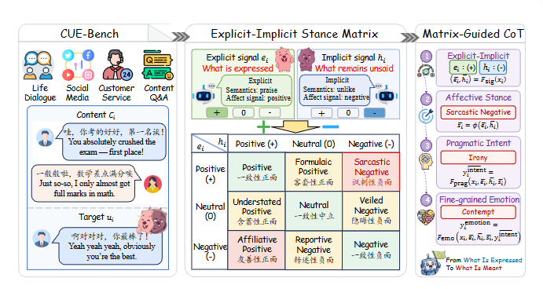

# Surfacing the Unsaid: CUE-Bench for Affective Stance in Chinese Discourse

<p align="center">
  <a href="https://ai4ss.github.io/CUE-Bench/">
    
  </a>
  <a href="https://arxiv.org/abs/2608.10810">
    
  </a>
  <a href="data/refined_full_release/cuebench_v3.1_full.jsonl">
    
  </a>
  <a href="LICENSE">
    
  </a>
</p>

This repository contains the official data and evaluation resources for **CUE-Bench**, a Chinese discourse benchmark for understanding **unsaid emotion** through **Affective Stance**.

<p align="center">
  
</p>

> **Abstract.** Emotion understanding in discourse requires reasoning beyond surface sentiment, since speakers often convey affect through indirect, implicit, polite, ironic, or deliberately mismatched expressions. Existing emotion benchmarks mainly annotate surface polarity or final emotion categories, while lacking a structured account of how explicit expression, implicit affect, pragmatic intent, and fine-grained emotion interact. To address this gap, we introduce **CUE-Bench**, a Chinese Unsaid Emotion benchmark that centers on **Affective Stance** and covers diverse communicative scenarios. CUE-Bench constructs nine human-interpretable affective stances from Explicit-Implicit polarity interaction and further provides intent and fine-grained emotion annotations for structured affective inference.

---

## Highlights

- **A benchmark for unsaid affect in Chinese discourse.** CUE-Bench focuses on cases where literal wording and intended affect diverge, such as irony, politeness, understatement, veiled negativity, and formulaic expression.
- **A structured Explicit-Implicit Stance Matrix.** We operationalize affective stance as the interaction between surface expression and implied affect, yielding nine human-interpretable stance categories.
- **Multi-level supervision for pragmatic affect understanding.** Each instance is annotated with explicit/implicit affect, Affective Stance, Pragmatic Intent, and Fine-grained Emotion.
- **A matrix-guided reasoning framework.** Incorporating Affective Stance improves fine-grained emotion recognition by **3.1** percentage points and pragmatic intent detection by **8.1** percentage points over strong baselines.
- **Broader coverage of stance phenomena.** The refined release improves coverage of rare stance categories, especially news-style **Reportive Negative** cases.

---

## Repository Structure

```text
CUE-Bench/
  data/
    paper_experimental_split/ # experimental split used in the paper
    refined_full_release/     # refined full release version
  prompts/                    # public task-level prompt templates
  code/                       # evaluation and metric scripts
  docs/                       # paper PDF
  release_summary.json        # data statistics for release checking
```

---

## Dataset Versions

### Paper Experimental Split

`data/paper_experimental_split/` contains the split used for the paper experiments.

| Split | File | #Samples |
|---|---:|---:|
| Train | `train.jsonl` | 36,685 |
| Dev | `dev.jsonl` | 5,162 |
| Test | `test.jsonl` | 5,163 |

### Refined Full Release

`data/refined_full_release/` contains the refined full release expanded from the paper experimental split. The source-specific files share the same `sample_id` values as `cuebench_v3.1_full.jsonl`.

| File | Description | #Samples |
|---|---|---:|
| `cuebench_v3.1_full.jsonl` | Full v3.1 release | 52,882 |
| `two_model_agreement.jsonl` | Samples accepted through two-model agreement | 24,164 |
| `human_verified.jsonl` | Samples verified by human review | 9,598 |
| `gpt_adjudicated_after_disagreement.jsonl` | Samples accepted after model-disagreement adjudication | 17,855 |
| `reportive_negative_expansion.jsonl` | Additional Reportive Negative samples in the refined release | 1,265 |

---

## Data Sources

CUE-Bench uses existing Chinese corpora as text pools and creates new Affective Stance, Pragmatic Intent, and Fine-grained Emotion annotations through our annotation pipeline. The source labels from the original datasets are not reused as CUE-Bench labels.

The main text pools include LCCC, JDDC, the CCAC 2024 Chinese Sarcasm Calculation dataset, Zhihu QA, and CN-SarcasmBench. The refined v3.1 release additionally uses CNewSum and CEC-Corpus to improve coverage of news-style Reportive Negative cases. Please follow the licenses and terms of the original source datasets when using CUE-Bench.

---

## Data Format

Each JSONL record contains the following fields:

| Field | Description |
|---|---|
| `sample_id` | Sequential public release ID. |
| `text` | Target utterance. |
| `context` | Discourse context. |
| `scenario_type` | Discourse scenario type. |
| `speaker_role` | Speaker role when available. |
| `explicit_polarity` | Surface polarity of the target utterance. |
| `explicit_emotion` | Surface emotion category. |
| `implicit_polarity` | Implied polarity inferred from context. |
| `implicit_emotion` | Implied coarse emotion. |
| `affective_stance` | Affective Stance label. |
| `pragmatic_intent` | Pragmatic Intent label. |
| `fine_grained_emotion` | Fine-grained Emotion label. |
| `quality_tier` | Annotation source/mode in the v3 experimental split. |

Example record:

```json
{
  "sample_id": "cue_example_000001",
  "text": "你可真会安排，周六开会最让人开心了。",
  "context": "[工作群聊] 团队原本已经连续加班多天，负责人临时通知周六继续开会。",
  "scenario_type": "group_chat",
  "speaker_role": "team_member",
  "explicit_polarity": "Positive",
  "explicit_emotion": "Joy",
  "implicit_polarity": "Negative",
  "implicit_emotion": "Anger",
  "affective_stance": "Sarcastic Negative",
  "pragmatic_intent": "Irony",
  "fine_grained_emotion": "Contempt"
}
```

---

## Prompts and Evaluation

The `prompts/` folder contains public prompt templates for:

- Direct prompting
- Chain-of-Thought prompting
- Matrix-guided prompting
- Structure-only baseline
- Oracle-style ablations

Only the basic public prompt templates are included. Internal exploratory or model-specific prompt variants are not part of this release.

### Environment Setup

```bash
pip install -r requirements.txt
```

Set API credentials through environment variables:

```bash
export OPENAI_API_KEY=YOUR_API_KEY
export OPENAI_BASE_URL=https://api.openai.com/v1
```

### Run Evaluation

```bash
python code/llm_evaluate.py \
  --model gpt-4o-mini \
  --task stance \
  --method direct \
  --shot few
```

Available tasks:

```text
stance, intent, emotion
```

Available methods:

```text
direct, cot, chain, structure_only, gold_p, gold_pi
```

### Compute Metrics

```bash
python code/compute_metrics.py --all
```

---

## Paper

The arXiv preprint is available at:

```text
https://arxiv.org/abs/2608.10810
```

A local PDF copy is also provided at:

```text
docs/paper.pdf
```

---

## Citation

If you use CUE-Bench, please cite our paper:

```bibtex
@misc{zheng2026surfacingunsaidcuebenchaffective,
  title = {Surfacing the Unsaid: CUE-Bench for Affective Stance in Chinese Discourse},
  author = {Zhenyan Zheng and Yunyao Zhang and Junxi Sheng and Junqing Yu and Zikai Song},
  year = {2026},
  eprint = {2608.10810},
  archivePrefix = {arXiv},
  primaryClass = {cs.CL},
  url = {https://arxiv.org/abs/2608.10810}
}
```

---

## License

This project is released under the MIT License. See [LICENSE](LICENSE) for details.

